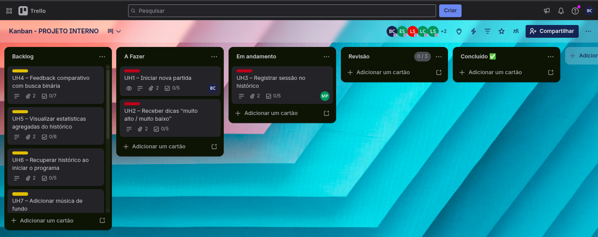
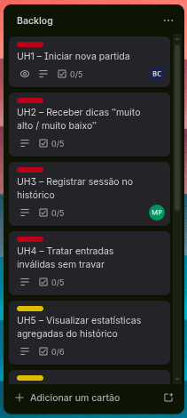
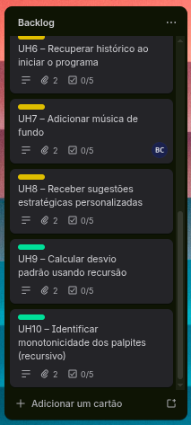
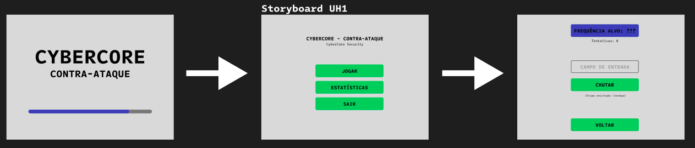
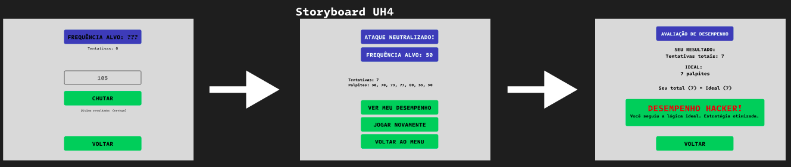

# Atalhos
- [Requisitos PIF](https://github.com/renanalencar/pif-2026-1-desc?tab=readme-ov-file#vis%C3%A3o-geral)
- [Entregas FDS](https://drive.google.com/file/d/1BAMUIo1b_WoI1TR8rMUF-cdp-Rh9lb6P/view)

# 🕹️ Jogo de Adivinhação – Decodificação de Frequência: Contra-ataque Hacker

Projeto Integrador 2026.1 – Programação Imperativa e Funcional (PIF)  
**Tema:** Jogo de adivinhação com narrativa de segurança cibernética.

## 📖 Sinopse

Você é um analista de segurança da CyberCore. Um ataque hacker está injetando uma frequência desconhecida (entre 1 e 100 MHz) nos servidores. Para neutralizar a invasão, você deve **descobrir a frequência alvo** com o menor número de tentativas possível. A cada palpite, o sistema informa se a frequência é muito baixa, muito alta ou correta. Cada partida é registrada em um arquivo de histórico, permitindo estatísticas e sugestões de melhoria.

## 👥 Equipe

| Integrante | Papel | Responsabilidades |
|------------|-------|--------------------|
| Breno Luiz de Lima Cruz | Desenvolvedor / Organizador / Documentador | Gerência do time, documentação geral, auxílio no desenvolvimento |
| Miguel Pereira de Lemos | Desenvolvedor / Especialista em C | Implementação da lógica principal, recursão, otimização em C |
| Eloi de Lima Sousa | Desenvolvedor de Front-end | Criação das telas, interface com o usuário (modo texto ou gráfico) |
| Lucas Felipe Barreto Cavalcante | Desenvolvedor de Back-end | Lógica do jogo, validações, persistência em arquivo |
| Lucas Filipe de Lima Segundo | Desenvolvedor de Front-end | Telas, experiência do usuário, fluxo de navegação |
| Leticia Gomes da Silva | Desenvolvedora de Front-end | Telas, componentes visuais, integração com back-end |
| Pablo Arthur Eustáquio de Lima | Desenvolvedor de Back-end | Algoritmos de análise estatística, recursão, manipulação de arquivos |

> **Nota:** Os papéis podem ser rotativos conforme a necessidade das sprints.

## 📦 Entrega 01 – Histórias de usuário, backlog e organização

### Quadro Kanban

### Backlog priorizado

### Histórias de usuário (detalhadas)
As 10 histórias completas estão disponíveis no [quadro do Trello](https://trello.com/b/MNMd59kf/kanban-projeto-interno) e também no arquivo [`historias.md`](docs/historias.md).

## 🎨 Entrega 02 – Prototipação, UX e Modelagem de Processos

### Protótipos de Baixa Fidelidade (Lo-Fi)
Os protótipos iniciais foram desenvolvidos no Figma para validar o fluxo de navegação e a hierarquia de informações.
- 🔗 [Acesse o protótipo no Figma aqui](https://www.figma.com/make/hvzhHgR8lGsDkOvLYZvtSs/CyberCore-Game-Prototype?t=PWjPK4Py01ldBkYl-20&fullscreen=1)

### Sketches e Storyboards
Abaixo estão os esboços manuais e a sequência narrativa das principais interações (mínimo de 10 unidades).

| História | Sketch / Storyboard |
|----------|---------------------|
| **UH1** |  |
| **UH2** |  |
| **UH3** |  |
| **UH4** |  |
| **UH5** |  |
| **UH6** |  |
| **UH7** |  |
| **UH8** |  |
| **UH9** |  |
| **UH10** |  |

- 🔗 [Acesse os sketches e storyboards no Figma aqui](https://www.figma.com/design/rhhIDpgt5qU3j4WoQvU7wj/Sem-t%C3%ADtulo?node-id=0-1&t=rytzOBqNChNGkl37-1)

> *Nota: Todos os arquivos também estão anexados aos seus respectivos cards no Trello.*

### Screencast do Protótipo
Vídeo demonstrativo da navegação e funcionalidades planejadas.
- 📺 [Assista ao Screencast](https://drive.google.com/file/d/1ptDQPoB4hk8FwIXI8O0mnft34nn2L9Tx/view?usp=sharing)

### Diagramas de Atividades do Sistema
Modelagem do fluxo lógico para cada uma das histórias de usuário.

- [ ] **UH1:** [Visualizar Diagrama](./assets/diagramas/atividade-uh1.jpg)
- [ ] **UH2:** [Visualizar Diagrama](./assets/diagramas/atividade-uh2.jpg)
- [ ] **UH3:** [Visualizar Diagrama](./assets/diagramas/atividade-uh3.jpg)
- [ ] **UH4:** [Visualizar Diagrama](./assets/diagramas/atividade-uh4.jpg)
- [ ] **UH5:** [Visualizar Diagrama](./assets/diagramas/atividade-uh5.jpg)
- [ ] **UH6:** [Visualizar Diagrama](./assets/diagramas/atividade-uh6.jpg)
- [ ] **UH7:** [Visualizar Diagrama](./assets/diagramas/atividade-uh7.png)
- [ ] **UH8:** [Visualizar Diagrama](./assets/diagramas/atividade-uh8.jpg)
- [ ] **UH9:** [Visualizar Diagrama](./assets/diagramas/atividade-uh9.jpg)
- [ ] **UH10:** [Visualizar Diagrama](./assets/diagramas/atividade-uh10.jpg)

> *Nota: Todos os arquivos também estão anexados aos seus respectivos cards no Trello.*

---

## 🚀 Próximas etapas
- **Entrega 03:** Implementação do jogo, persistência e estatísticas.
- **Entrega 04:** Projeto final polido, testes e documentação.

## 📚 Tecnologias
- Linguagem C (padrão C11)
- Biblioteca padrão: `stdio.h`, `stdlib.h`, `time.h`, `math.h`, `raylib.h`
- Persistência em arquivo texto (`historico.txt`)
- Compilação: `gcc -std=c11 -Wall -lm -o jogo main.c`

## 📄 Licença
Projeto acadêmico – sem fins comerciais.

---
*Repositório criado para a disciplina de PIF – Prof. mr-costaalencar*
